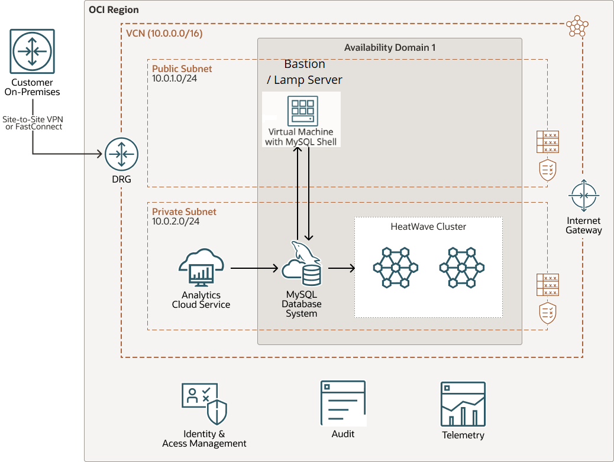

# Introduction

## About this Workshop

MySQL HeatWave is a fully managed database service with an integrated query accelerator which enables organizations to efficiently run transaction processing, real-time analytics, data warehouse and machine learning on data stored inside MySQL database or in the object store.

MySQL HeatWave eliminates the need for complex ETL operations to move data out of MySQL to run analytics or machine learning. Existing MySQL applications can run on MySQL HeatWave without any change and get orders of magnitude better query performance with the built-in query accelerator. With MySQL HeatWave, organizations can also run analytics on hundreds of terabytes of data in object store in a variety of file formats like CSV, Parquet, export files from Aurora or Redshift, without requiring data to be stored inside MySQL.

In this workshop, you will learn how to create a MySQL HeatWave Cluster, connect to the cluster using MySQL Shell, run queries on HeatWave, run Analytics workloads in Oracle Cloud, Use Oracle Analytics Cloud and Lakehouse, Machine Learning, and create a LAMP application.

Overall this workshop will show you how easy it is to create and manage MySQL HeatWave and how MySQL HeatWave enables you to make informed business-critical decisions with real-time insights.

_Estimated Lab Time:_ 3 hours

_Lab Setup

## About Product/Technology

MySQL HeatWave is the only cloud service that combines transactions, realtime analytics across data warehouses and data lakes, and machine learning in one MySQL Database—without the complexity, latency, risks, and cost of ETL duplication. It delivers unmatched price-performance. HeatWave AutoML enables native, in-database machine learning, allowing users to
build, train, deploy, and explain machine learning models inside MySQL,without machine learning expertise. MySQL Autopilot provides machine learning-powered automation that improves the performance, scalability,and ease of use of HeatWave, saving developers and DBAs significant time. The service can be deployed in OCI, AWS, Azure, in a hybrid environment,and in customers’ data center with OCI Dedicated Region.

## Objectives

In this lab, you will use OCI and HeatWave Services to help Fictitious Corp Eureka improve its Customer Satisfaction by completing the following labs:

1. Create MySQL HeatWave Database System
2. Create Development LAMP Server, Import Data and Application, and Test OLP Application
3. Setup HeatWave Cluster for OLAP/AutoML/Lakeshouse
4. Run OLAP Application and Run Query Comparissons Between MySQL and HeatWave Cluster
5. Upload passenger-survey data to Object Storage and import it to Lakehouse
6. Create Oracle Analytics Cloud and Analyze passenger-survey data
7. Create and test HeatWave AutoML Model
8. Add HeatWave AutoML Model to LAMP Application
9. Develop MySQL HeatWave Low Code Application with Oracle APEX
10. Stop OCI Services

## Prerequisites

- An Oracle Free Tier, Paid or LiveLabs Cloud Account
- Some Experience with MySQL Shell - [MySQL Site](https://dev.MySQL.com/doc/MySQL-shell/8.0/en/).

You may now **proceed to the next lab**

## Acknowledgements

- **Author** - Perside Foster, MySQL Principal Solution Engineering
- **Contributors** - Mandy Pang, MySQL Principal Product Manager,  Nick Mader, MySQL Global Channel Enablement & Strategy Manager
- **Last Updated By/Date** - Perside Foster, MySQL Solution Engineering, August 2023
